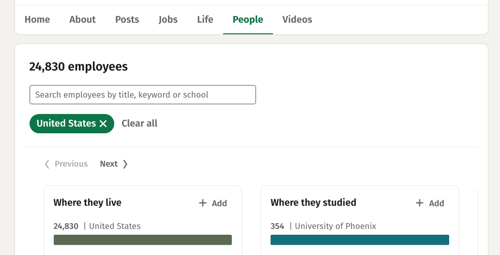
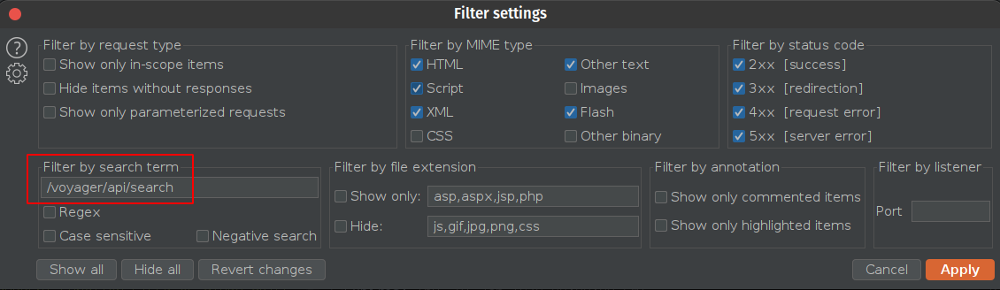
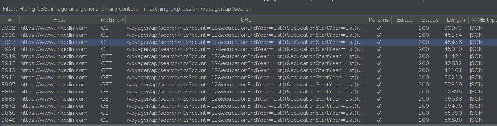

# inProfiles

Given a set of directories, look for files containing saved items from Burp containing LinkedIn api requests/responses.
Parse all of them and generate a pandas' DataFrame from their content, outputing
the result in CSV format.


## Use Case

You want to retrieve information about employees from a given company (OSINT) and generate a list of possible e-mails from that input.


## How-to

In order to generate a list with people data and their corresponding inferred e-mails, we need to perform some manual interaction on LinkedIn.

  1. Set up Burp to capture requests from LinkedIn
  1. Go to the company's page and navigate to People section
  
  1. Scroll down a few times in order to load employees mini-profiles
  1. Once reached the display limit, stop capturing requests
  1. Configure history or logger to show only the desired requests
  
  1. If everything is correct, you should see a list of API calls. Select all
  of them and click on "Save items" (make sure "Base64-encode requests and responses" is marked for better results)
  
  1. Save results in a preferably empty directory and run script


### Tip

The method above could bring a few junk data since the aforementioned API will be used to fetch information about your
current connections while you navigate on the site.

Another aproach is to go to People search (from homepage not company one), filter by "Current Company" and other fields of your interest.
The result will be spread in pages (which you can reach by clicking "Next" instead of scrolling).
Once you reach the end, go to Burp and filter GET requests containing ~~`/voyager/api/voyagerSearchDashLazyLoadedActions`~~ `/voyager/api/search`.
From this point, follow the procedure above.

  
## Help

```
poetry run ./inProfiles.py -h
usage: inProfiles.py [-h] -d DOMAIN [-p {first.last,first,last,flast}] [-n] [-r]
                     [-s] [--columns COLUMN [COLUMN ...]]
                     [--drop-columns COLUMN [COLUMN ...]]
                     [--sort-by COLUMN [COLUMN ...]] [--query QUERY]
                     dir [dir ...]

Parse Burp's saved items from LinkedIn data

positional arguments:
  dir                   root directories

optional arguments:
  -h, --help            show this help message and exit
  -d DOMAIN, --domain DOMAIN
                        Domain name
  -p {first.last,first,last,flast}, --pattern {first.last,first,last,flast}
                        Email pattern (default: first.last)
  -n, --dry-run         Only list the files that should be read
  -r, --recursive       Recursively search for files starting from root directory
  -s, --silent          Ommit logging messages
  --columns COLUMN [COLUMN ...]
                        Columns to write to output
  --drop-columns COLUMN [COLUMN ...]
                        Drop columns (properties) from result
  --sort-by COLUMN [COLUMN ...]
                        Sort result by columns
  --query QUERY         Apply query to filter final dataset
```


## Example

```
poetry run ./inProfiles.py -d contoso.com burp-base64-dir > profiles.csv
```

Filter out your own profile (which comes together in some results)

```
poetry run ./inProfiles.py -d contoso.com --query "publicIdentifier != 'your-id'" burp-base64-dir  > profiles.csv
```

### Note

If a pattern containing surname have been chosen, this tool will try to infer e-mails based not only on surnames but also on middle names.
The e-mails will be contained in a "|"-separated string, in the last column by default.


### Tip
Once you have the profiles saved in a file, you can easily get a list of emails with

```
awk -F, '{print $(NF)}' profiles.csv | grep @ | tr '|' '\n'
```

